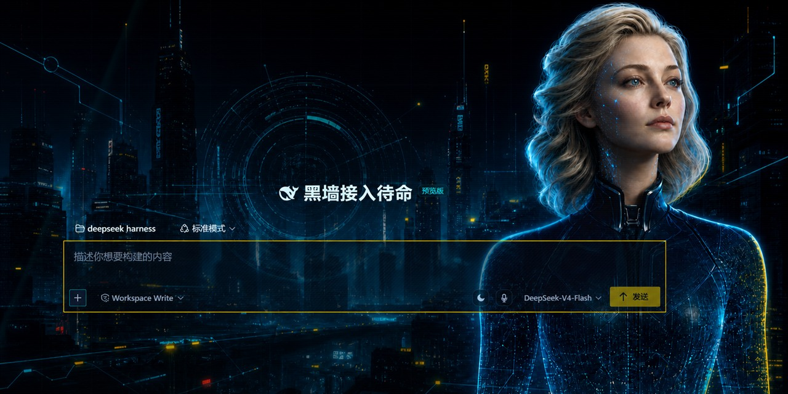

# Neon Harness

[English](README.md) | 中文

> **重要：** Neon Harness 是 [DeepSeek Harness](https://github.com/deepseek-ai/deepseek-harness) 的非官方社区分支，与 DeepSeek 不存在隶属、合作或官方背书关系。

<p align="center">
  
</p>

Neon Harness 是面向 DeepSeek Harness 的赛博朋克多智能体指挥中心。它保留上游的插件架构与真实智能体工作流，同时提供中文优先的霓虹界面，覆盖对话、代码执行、辩论与轨迹检查。

## 主要特性

- 三个工作台根据真实会话状态自动派生：对话、代码执行与多智能体轨迹。
- VS 辩论竞技场使用真实参与者、回合、裁判和子代理状态。
- 统一的左右对话布局、按角色切换的 CG 头像，以及由真实目标、任务、子代理、审批和交付物驱动的任务控制栏。
- 语音输入、错峰执行控制、外观设置、启动语音、响应式布局、减少动态效果支持与真实 Host 浏览器覆盖。
- 围绕真实输入框构建的霓虹城市接入首页，不使用静态界面假图。

## 当前状态

本分支处于开发者预览阶段。随着上游项目与 Neon 工作台持续演进，界面和配置可能发生变化。

<a id="run"></a>

## 从源码运行

### 环境要求

- Node.js `^22.19` 或 `>=24`
- pnpm

### 启动

```sh
git clone https://github.com/xinyuquan985-coder/deepseek-harness-neon.git
cd deepseek-harness-neon
pnpm install
pnpm run build
pnpm dsh web
```

Host 启动后打开 `http://127.0.0.1:3080`。Web UI 必须通过 Harness Host 运行，因为裸 Vite 不会提供 `window.__DSH_BOOT__`。

Windows 还可以使用仓库内的本地启动器：

```powershell
.\start-deepseek-harness.cmd
```

## 工作台路由

- **对话工作台**是默认的会话与任务控制空间。
- **代码执行工作台**会在当前轮次出现真实代码变更或终端活动时展示。
- **轨迹工作台**展示多智能体执行账本、选中请求详情、审批、后台任务、子代理与产出文件。

它们是产品状态，不是主题，也不是手动选择的 A/B/C 模式。`对话`、`VS 对决` 与 `轨迹` 标签保留原有行为，只切换中央工作区域。

## 社区

- 在 [GitHub Discussions](https://github.com/xinyuquan985-coder/deepseek-harness-neon/discussions) 提问并分享截图。
- 通过 [GitHub Issues](https://github.com/xinyuquan985-coder/deepseek-harness-neon/issues) 报告可复现问题。
- 在 [DeepSeek Harness](https://github.com/deepseek-ai/deepseek-harness) 关注原项目。

## 参与贡献

提交 Pull Request 前请阅读 [CONTRIBUTING.md](CONTRIBUTING.md)。开发请先查看[开发指南](docs/development.md)与[架构文档](docs/architecture.md)；智能体还必须遵循 [AGENTS.md](AGENTS.md)。

## 提交前的隐私检查

- 不要提交 `.env` 文件、API 密钥、Token、凭据、会话日志或本地运行目录。
- 将 `.dsh-home/`、`.dsh-runtime/`、`logs/` 和包含本机信息的截图排除在提交之外。
- 每次推送前检查暂存文件和提交元数据。

私下报告安全漏洞的方式见 [SECURITY.md](SECURITY.md)。

## 上游与致谢

Neon Harness 基于 [DeepSeek Harness](https://github.com/deepseek-ai/deepseek-harness) 及其“一切皆插件”架构构建。运行时由 [Cordis](https://github.com/cordiverse/cordis) 驱动，其设计见论文 [_A Programming Paradigm for Spatiotemporal Composability_](https://github.com/cordiverse/paper)。

## 许可证

本仓库采用[组合授权](LICENSE)：来自上游 DeepSeek Harness 的内容继续遵循其 [MIT 许可证](LICENSES/UPSTREAM-MIT.txt)，Neon Harness 原创软件增量采用 [PolyForm Noncommercial 1.0.0](LICENSES/PolyForm-Noncommercial-1.0.0.md)。Neon 专属人物立绘、界面截图、音频和品牌素材仅供个人学习、教育、研究、测试及其他非商业用途；将 Neon 原创增量或素材用于商业项目必须另行取得书面许可，但该限制不会撤销上游 MIT 已授予的权利。第三方依赖继续遵循 [THIRD_PARTY_NOTICES.md](THIRD_PARTY_NOTICES.md) 中列出的许可证。
